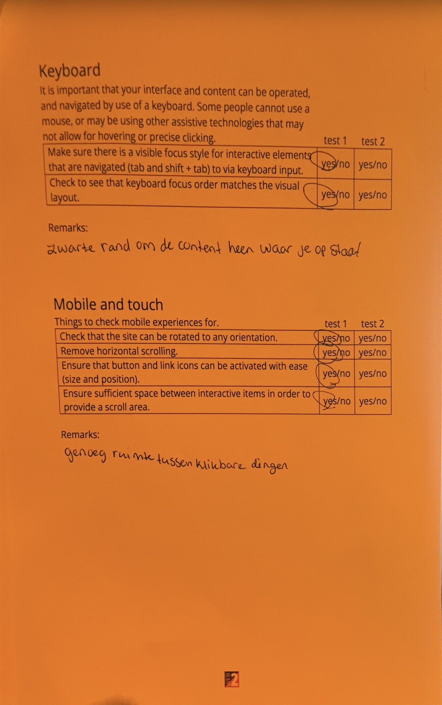
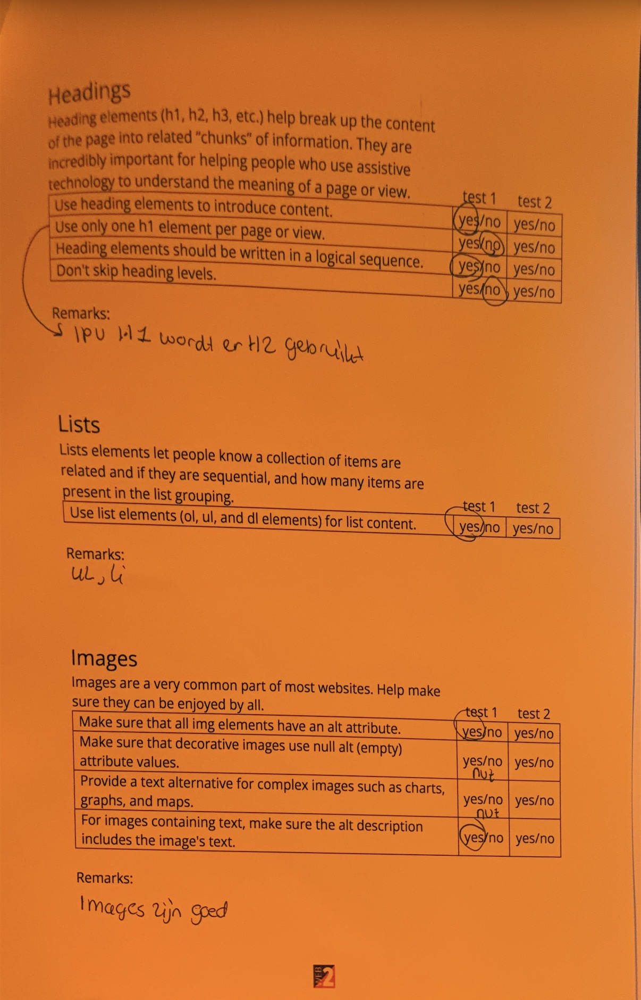
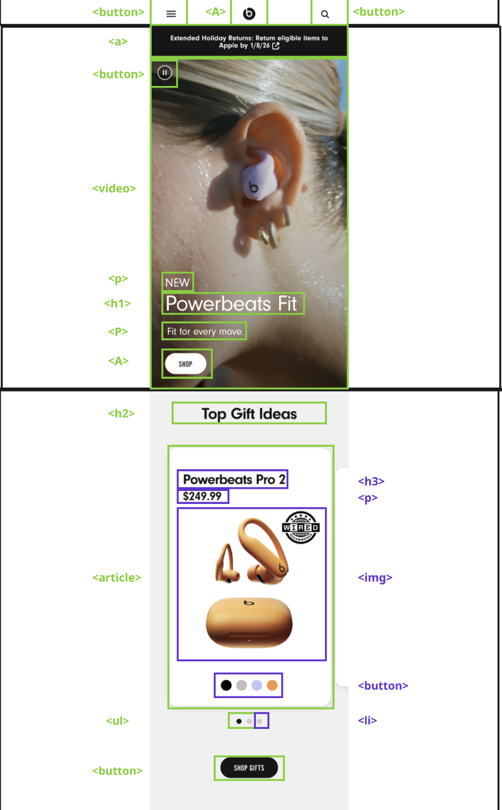
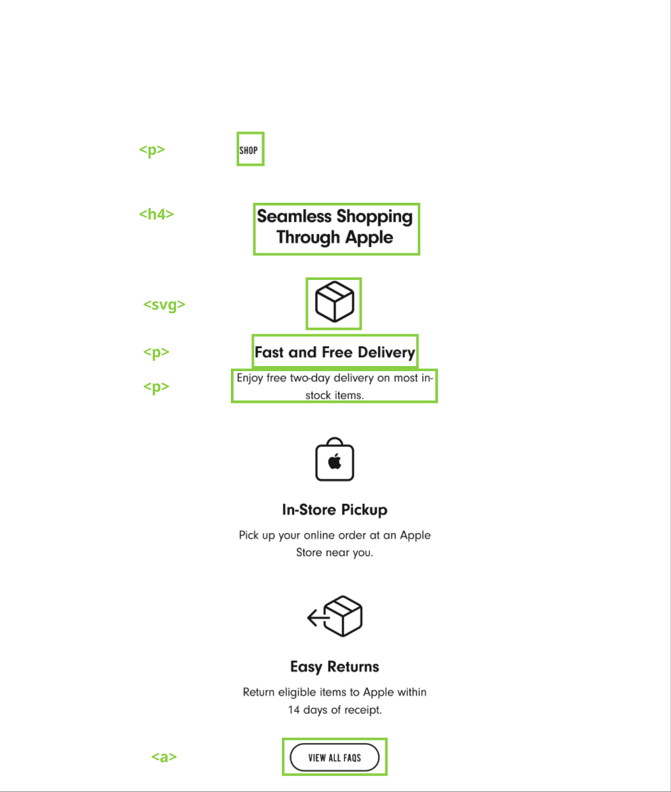
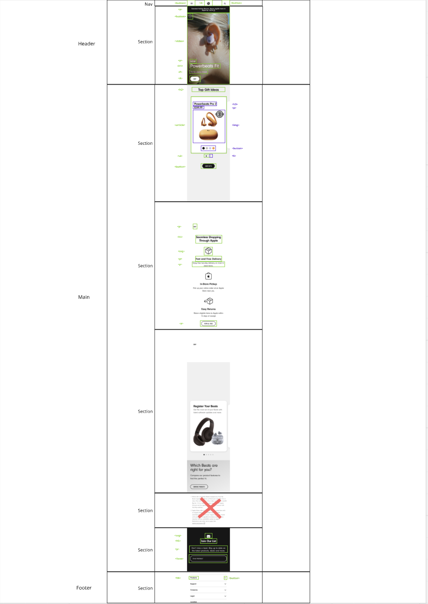
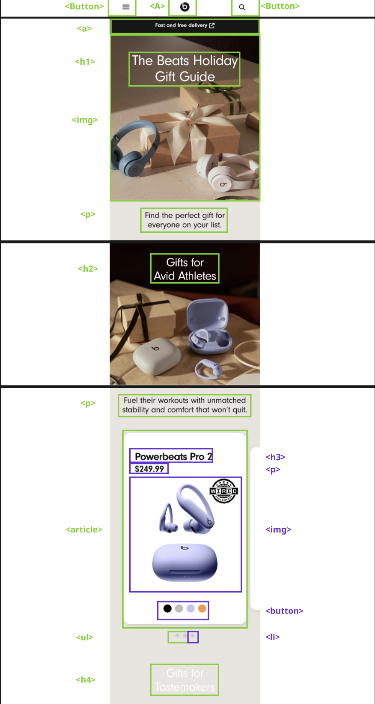

# Procesverslag

Markdown is een simpele manier om HTML te schrijven.  
Markdown cheat cheet: [Hulp bij het schrijven van Markdown](https://github.com/adam-p/markdown-here/wiki/Markdown-Cheatsheet).

Nb. De standaardstructuur en de spartaanse opmaak van de README.md zijn helemaal prima. Het gaat om de inhoud van je procesverslag. Besteedt de tijd voor pracht en praal aan je website.

Nb. Door _open_ toe te voegen aan een _details_ element kun je deze standaard open zetten. Fijn om dat steeds voor de relevante stuk(ken) te doen.

## Jij

  
uitwerken voor kick-off werkgroep

### Auteur:

Jazzmine Pools

#### Je startniveau:

blauw

#### Je focus:

responsive

## Je website

  
uitwerken voor kick-off werkgroep

### Je opdracht:

https://www.beatsbydre.com/

#### Screenshot(s) van de eerste pagina (small screen):

Home

#### Screenshot(s) van de tweede pagina (small screen):

Giftguide

## Toegankelijkheidstest 1/2 (week 1)

  
uitwerken na test in 2e werkgroep

### Bevindingen

Lijst met je bevindingen die in de test naar voren kwamen:

HOME

De headings worden voorgelezen.
De linkjes worden voorgelezen en leiden naar de goede plek.
Een video wordt aangegeven met play/stop button.
Bij background foto's wordt er een goede alt tekst gegeven.
Wanneer je bij "Which beats are right for you?" na het oplezen van de image springt hij terug omhoog naar "The Beat holiday giftguide" Daarna springt hij terug naar wat er onder de image van "Which beats are right for you?" staat. Dit kan voor verwarring zorgen omdat deze content ver uit elkaar staat.

Op de homepagina is er een soort carrousel waarbij de images niet worden opgenoemd en ook geen alttekst

Op dezelfde pagina zijn er SVG's die niet worden benoemd en ook geen alttekst hebben.

De mail SVG wordt geen alt tekst gegeven. Als dit wel zou worden gedaan zou het duidelijker zijn voor de gebruiker.

GIFTGUIDE

Bij een product zijn er meerdere kleurenopties. De screenreader lees bijvoorbeeld: "Powerbeats Pro 2 black, Powerbeats Pro 2 purple, Powerbeats Pro 2 beige" in 1 keer op. Omdat het zo snel gaat kan het onduidelijk zijn voor de gebruiker welke kleuren er zijn, omdat je constant de naam hoort van het product. Het zou gebruikersvriendelijker zijn als de screenreader "Powerbeats Pro 2 in colors black, orange, purple and beige" opleest. Weet alleen niet of dit mogelijk is.

Meerdere keren op de pagina selecteert voice-over een leeg vakje en zegt "and one more item group" maar er is geen content om op te klikken of beschrijving van iets. Hetzelfde gebeurt iets verder op de pagina. Iets voor de footer is er een kopje met "Which beats are right for you?" Ook daar zijn er meerdere lege vakjes waar "and one more item group" wordt voorgelezen terwijl er niks te zien is.

WCAG checklist images:

## Breakdownschets (week 1)

  
uitwerken na afloop 3e werkgroep

### de hele pagina: pagina 1

  

### dynamisch deel (bijv menu):

 
 
 

### de hele pagina: pagina 2

  

### dynamisch deel (bijv menu):

   

Pagina 2 screenshot mist footer. Om een of andere reden pakt hij de footer niet mee in de screenshot. Het is natuurlijk dezelfde footer als pagina 1. Pagina 2 is niet zo interessant op mobiel, maar wanneer je naar tablet of laptop formaat gaat is de content wel interessant.

## Voortgang 1 (week 2)

  
uitwerken voor 1e voortgang

### Stand van zaken

hier dit ging goed & dit was lastig (neem ook screenshots op van delen van je website en code)

### Agenda voor meeting

samen met je groepje opstellen

| student 1      | student 2          | student 3    | student 4        |
| -------------- | ------------------ | ------------ | ---------------- |
| dit bespreken  | en dit             | en ik dit    | en dan ik dat    |
| en dat ook nog | dit als er tijd is | nog een punt | dit wil ik zeker |
| ...            | ...                | ...          | ...              |

### Verslag van meeting

hier na afloop snel de uitkomsten van de meeting vastleggen

- punt 1
- punt 2
- nog een punt
- ...

## Voortgang 2 (week 3)

  
uitwerken voor 2e voortgang

### Stand van zaken

hier dit ging goed & dit was lastig (neem ook screenshots op van delen van je website en code)

### Agenda voor meeting

samen met je groepje opstellen

| student 1      | student 2          | student 3    | student 4        |
| -------------- | ------------------ | ------------ | ---------------- |
| dit bespreken  | en dit             | en ik dit    | en dan ik dat    |
| en dat ook nog | dit als er tijd is | nog een punt | dit wil ik zeker |
| ...            | ...                | ...          | ...              |

### Verslag van meeting

hier na afloop snel de uitkomsten van de meeting vastleggen

- punt 1
- punt 2
- nog een punt
- ...

## Toegankelijkheidstest 2/2 (week 4)

  
uitwerken na test in 9e werkgroep

### Bevindingen

Lijst met je bevindingen die in de test naar voren kwamen (geef ook aan wat er verbeterd is):

## Voortgang 3 (week 4)

  
uitwerken voor 3e voortgang

### Stand van zaken

hier dit ging goed & dit was lastig (neem ook screenshots op van delen van je website en code)

### Agenda voor meeting

samen met je groepje opstellen

| student 1      | student 2          | student 3    | student 4        |
| -------------- | ------------------ | ------------ | ---------------- |
| dit bespreken  | en dit             | en ik dit    | en dan ik dat    |
| en dat ook nog | dit als er tijd is | nog een punt | dit wil ik zeker |
| ...            | ...                | ...          | ...              |

### Verslag van meeting

hier na afloop snel de uitkomsten van de meeting vastleggen

- punt 1
- punt 2
- nog een punt
- ...

## Eindgesprek (week 5)

  
uitwerken voor eindgesprek

### Je uitkomst - karakteristiek screenshots:

  

### Dit ging goed/Heb ik geleerd:

Korte omschrijving met plaatjes

  

### Dit was lastig/Is niet gelukt:

Korte omschrijving met plaatjes

  

## Bronnenlijst

  
continu bijhouden terwijl je werkt

Nb. Wees specifiek ('css-tricks' als bron is bijv. niet specifiek genoeg).
Nb. ChatGpT en andere AI horen er ook bij.
Nb. Vermeld de bronnen ook in je code.

1. bron 1
2. bron 2
3. ...

